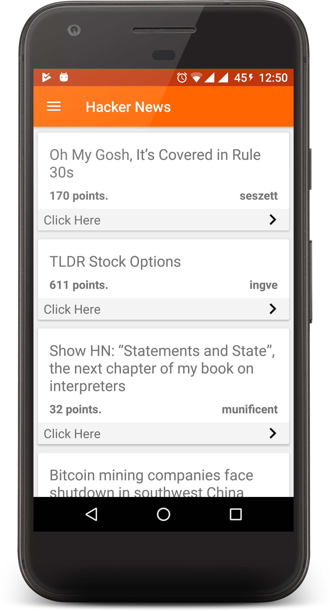

# Hacker News Android App

Hi, 
This is a android client for the Hacker news api. 
I am using the https://hacker-news.firebaseio.com/v0/item/8863.json?print=pretty environment to fetch information.
The link to the API repo is :~
https://github.com/HackerNews/API

# ScreenShots

